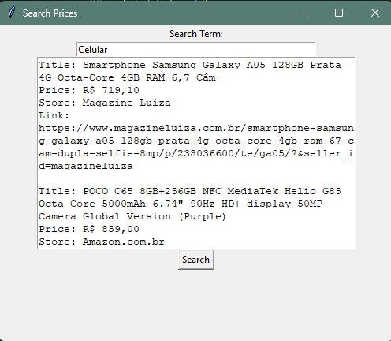

# Search Prices

This is a simple GUI application to search prices using Selenium and Tkinter.

## Installation

1. Clone the repository:

   ```bash
   git clone https://github.com/yourusername/my_project.git
   cd my_project

   ```

2. python -m venv venv
   source venv/bin/activate # On Windows use `venv\Scripts\activate`

3. pip install -r requirements.txt

4. Run the app, 'python ap.py'

5. Put ypur search term and click on Seach button
   
